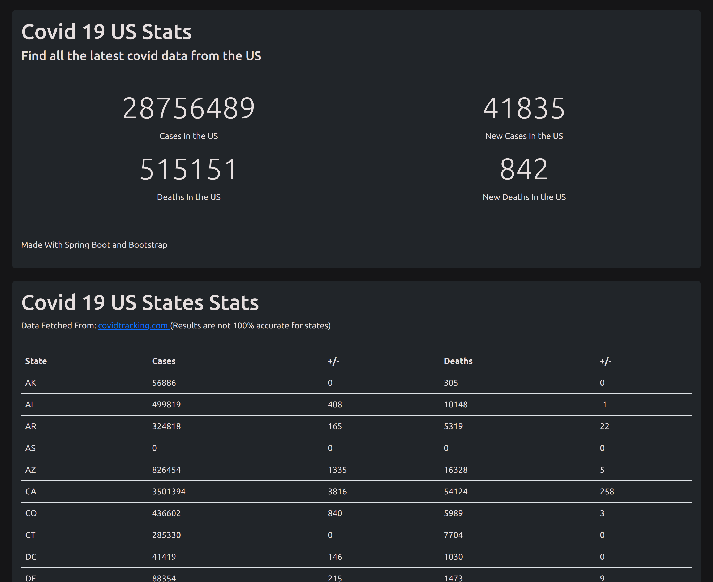

# Basic US Covid-19 Data Visualizer
A simple Spring Boot + Bootstrap + Thymeleaf fullstack Web Application that simply displays data from a free covid-19 api for the US.
For the US states, the data from the api is somewhat innacurate.
# Visual
